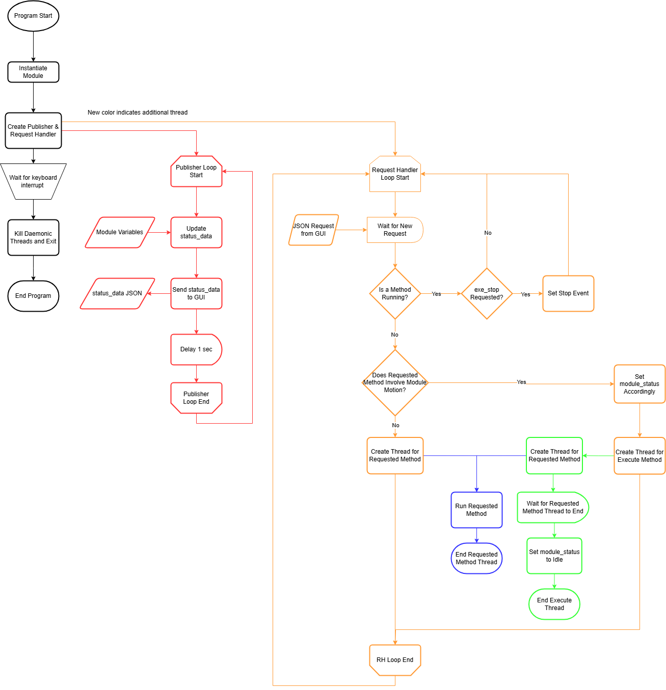

# Overview
The purpose of this code is to operate the physical system. It can receive commands from the GUI and execute the requested method while publishing data on the current module status.

  

---
# Files

## opticalmodule.py
This Python file contains classes that represent the physical system with methods for system operation.

## rpmain.py
This Python file handles opening and closing sockets and functions for publishing data and handling requests from the GUI.

