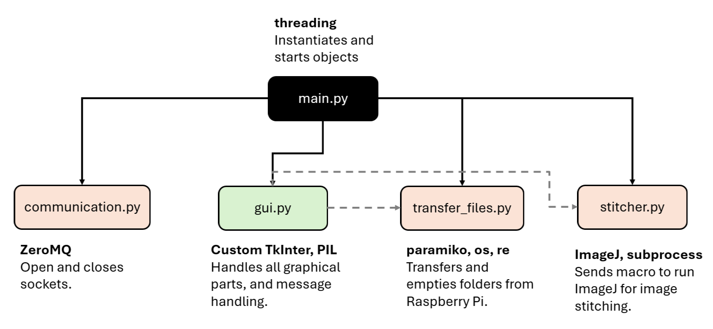
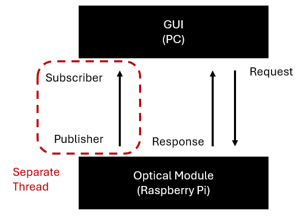

# Overview
The purpose of this code is to communicate user requests to the Optical module code (i.e. Raspberry Pi). User requests are handled in a Graphical User Interface (GUI). 
The code is designed to be run on a Windows PC that is connected to the Raspberry Pi with an ethernet cable.

  

---
# Files

## main.py
All the python files for the pc, except for main, are simply classes. Main instantiates objects from the other python files, and then starts the program. It also assists with closing the sockests and program smoothly when the gui exits.

## communication.py
This python file handles opening and closing sockets. The python library to handle the sockets is ZeroMQ. There are two sockets used:

**SUB Socket**
The subscriber socket works in tandem with the Raspberry Pi's publisher socket. The Raspberry Pi sends live data to the PC every second.
This is run on a seperate thread, so that it can continue to get updates asynchronously.

**REQ Socket**
The request socket works in tandem with the Raspberry Pi's response socket. This is used to send JSON objects to the Raspberry Pi to detail user requests (e.g. exe_stop, number of sampling images).

**Note**
The IP address, host name, and password are hardcoded into the code. Change as needed to fit the specs of your Raspberry Pi, or whichever device you use.

  

## stitcher.py
The stitcher program runs a macro that passes in arguments to ImageJ (i.e. FiJi). The image stitching process takes some time (up to 2 minutes). Therefore, this process is also run on a seperate thread when it is called.

## transfer_files.py
Images are stored in a folder on the Raspberry Pi called "image_buffer", regardles of the process being executed. A SFTP client connection must be opened in order to transfer those files from a directory in the Rapsberry Pi, over to a directory in the PC. Furthermore, to empty the "image_buffer" folder, a SSH client connection is created and then closed after completeion. This python file handles all this communication and connections.

## gui.py
gui.py is basically the "main" code, as it handles all the graphical parts of the GUI, as well as uses the objects from the other files to communicate and sequence the use requests to the Raspberry Pi.

The code can be seperated into three main chunks, in order of how it was written: instantiation of variables, graphical components, message handling with the Raspberry Pi.

### Instantiation
At the top of the program, many variables are instantiated. Without some of these instatiations, errors may arise as some variables are updated every second from the Raspberry Pi, but would otherwise only be instantiated if that particular screen where the variable is displayed is open.

Note that it is in this section where the folder paths are instantiated. Change these directories as needed to match your directory.

### Graphics
Most of the code is simply widgets, frames, budgets etc. to display the GUI. Key functionality to note is that many of the buttons use functions that send data to the Raspberry Pi. For example, the section of code that programs the "Stop" button, will also have the code that sends the command to the Raspberry Pi.

### Communication
This section of code includes the image transferring (ie using transfer_files.py), code for starting the stitching thread, the step by step processes for handling scanning and sampling processes. There are two key functions I want to note:

**update_status_data**

This function is run every second on a seperate thread as it is used in the CommunicationHandler object. This function is run every second, so to ensure thread security, only unpacking JSON data should be completed here, and everything else should be completed on the main thread.

**update_gui_elements**

This function is called within the update_status_data function like so:

`self.content_frame.after(0, self.update_gui_elements)`

This ensures all actions that need to take place in response to the Raspberry Pi's live data should happen here. This is where significant updates are coded, as well as the "state machine" like code for running scanning and sampling. 
Note that anything that takes more than ~1 second will cause the code to crash, as the function is called every second. Therefore, for any functions that require more time, run that functino on a seperate thread. For example, this is done for stitching as well as transferring the files from the Raspberry Pi.

---
# In Progress
## Calibration Routine
The platform and camera are leveled and aligned manually. To "calibrate" the camera should return focus 

## Starting Raspberry Pi Remotely
Currently, there is code in main.py (ie run_rpi_python_file function) that can succesfully start the Raspberry Pi upon running main.py on the PC. However, there is not any code yet that will close the sockets on the Raspberry Pi when the GUI closes, like there is in main.py. This needs to be completed before run_rpi_python_file should be uncommented.
