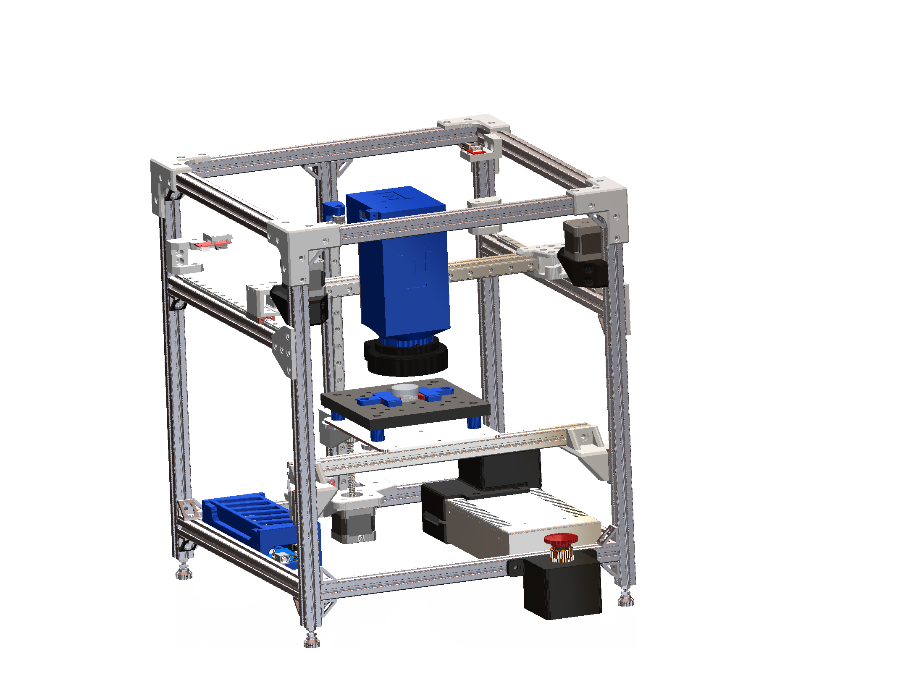

# OpticalModule

This Github repository is for storing all pertinent information regarding the functionality and design of the optical module.

The CAD folder will have a fully assembly of the optical module, along with files for all the 3D printed parts.

The [Programming](Programming_Files/) folder will have all programming files for the project. [pc_files](Programming_Files/ppc_files) has all python files to be run on a windows PC, to interact with the Raspberry Pi with a GUI. [module_program](Programming_Files/module_program) has all the files to be run on the Raspberry Pi. Keep in mind that file paths are hardcoded, and would need to be modified on new devices.

[Images](Images/) hold some sample images of diferent aspects of the project.

[Documentation](Documentation/) lists documents relating to design, use and assemly (e.g. BOM, manual).
