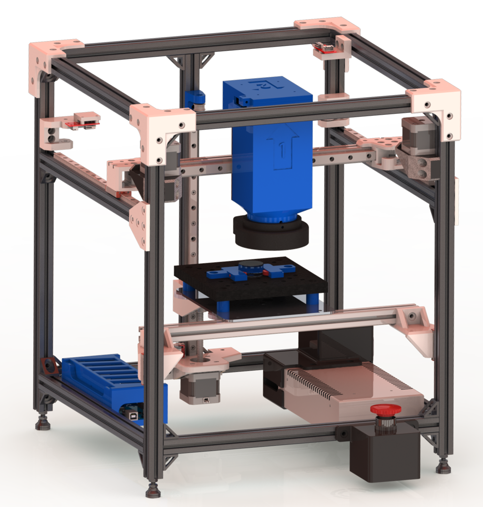
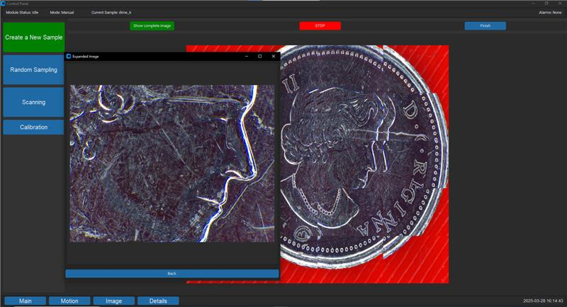

# OpticalModule

This Github repository is for storing all pertinent information regarding the functionality and design of the optical module.

  

  

---

The [CAD folder](CAD/) has the full assembly of the optical module, along with files for all the 3D printed parts and engineering drawings for machined parts

The [Programming folder](Programming%20Files/) has all the programming files for the project. [pc_files](Programming%20Files/pc_files) has all python files to be run on a windows PC, to interact with the Raspberry Pi with a GUI. [module_program](Programming%20Files/module_program) has all the files to be run on the Raspberry Pi. Keep in mind that file paths are hardcoded, and would need to be modified on new devices.

[Images](Images/) holds images of various aspects of the project. Flowcharts, sample images, and images of the physical product.

[Documentation](Documentation/) lists documents relating to design, use and assembly (e.g. BOM, manual).
